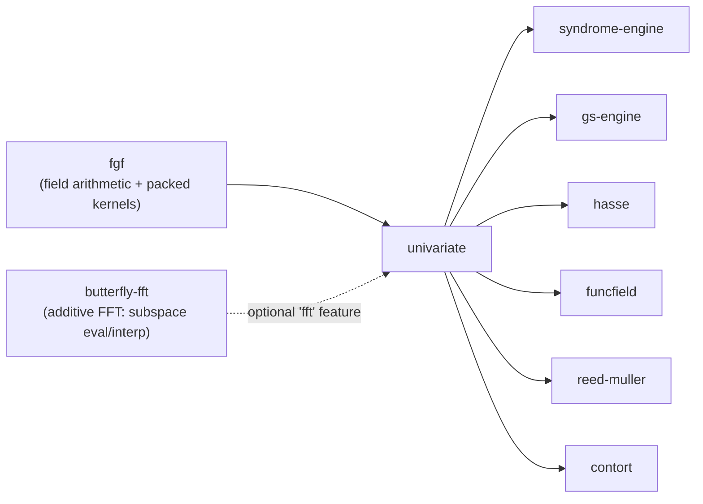

# `univariate` planning set

`univariate` — the **univariate polynomial ring over GF(2^m)** node of the FEC
stack. Multiply, divide, gcd, evaluate, find roots, interpolate, and work modulo
`x^t`, sitting on `fgf` for field arithmetic and packed-buffer kernels and
composing `butterfly-fft` for the additive-FFT transform paths. It serves
`syndrome-engine`, `gs-engine`, `hasse`, `funcfield`, `reed-muller`, and
`contort`.

This crate takes the dependency-graph node currently labelled `poly` (the name
`poly` is taken); `univariate` is its permanent name. Unlike `gfm`, which
collapsed six independent Gaussian eliminations, this is a **single-source
extraction**: a full, `fgf`-dispatched, packed-byte univariate library already
exists as a private module of `gs-engine`, and this crate lifts it to an L1
object — plus the classical decoder primitives that exist nowhere in the tree.

## Reading order

| Doc | Contents |
| --- | --- |
| [`00-charter.md`](00-charter.md) | Object, one-sentence scope, boundaries, non-goals, the nine load-bearing invariants (U1–U9), settled decisions. Read first; everything else defers to it. |
| [`01-landscape.md`](01-landscape.md) | Every existing univariate-polynomial implementation in this repo, with a TAKE/LIFT/LEAVE verdict; the primitives that exist nowhere; the consumer demand table. |
| [`02-architecture.md`](02-architecture.md) | Module layout, the `Polynomial<F>` type, `EvaluationDomain<F>`, error model, trait seams, backend handling, why compose `butterfly-fft`. |
| [`03-algorithms.md`](03-algorithms.md) | Every algorithm the crate owns, specified, each paired with the **independent oracle** that decides correctness. Literature cited. |
| [`04-roadmap.md`](04-roadmap.md) | Eight phases with acceptance criteria. Phase 6 is the clean cutover that makes `gs-engine` a consumer. |
| [`05-conventions.md`](05-conventions.md) | **Dependencies**, manifest, lints, error design, testing layers, CI matrix, benchmark policy. |
| [`06-optimizations.md`](06-optimizations.md) | Every optimization considered, ranked by payoff ÷ cost, with the measurement that justifies it. |
| [`07-baselines.md`](07-baselines.md) | Implementations to benchmark against, and the sources to implement from. Licenses flagged. |
| [`08-risks.md`](08-risks.md) | Risks with trigger / blast radius / mitigation, plus the open decisions with defaults — including the truncated-EEA seam with `gfm`. |
| [`09-poly-rename.md`](09-poly-rename.md) | The `poly` → `univariate` rename fallout applied to the root docs. |

## The short version

Three facts fix the crate's shape.

**The mature implementation already exists — trapped in an L2 crate.**
`gs-engine/src/poly/` (`Polynomial<F>` + `arithmetic.rs`) and
`gs-engine/src/roots/` are a full, `fgf`-dispatched, packed-byte univariate
library. It cannot be reused by `syndrome-engine`, `contort`, `funcfield`,
`hasse`, or `reed-muller` because it is a private module of the Guruswami–Sudan
engine. `univariate` is the extraction: the ring becomes an L1 object and
`gs-engine` becomes its first consumer. This is a single-source extraction plus
the gaps below — the mirror image of `gfm`, which collapsed six copies; here
there is one canonical copy and several thin duplicates.

**The ring is the object; the transform is `butterfly-fft`'s.** Fast multipoint
evaluation over an additive subspace *is* the additive FFT, and `butterfly-fft`
owns that layout and kernel. `univariate` composes `TransformPlan::forward/
inverse` + `monomial↔novel` for structured domains and owns only the
arbitrary-point Horner / subproduct-tree path. It never grows a second
additive-FFT.

**The classical decoder primitives are missing everywhere.** Extended Euclidean
with Bézout cofactors, the truncated/partial EEA that solves a key equation,
classical Chien search, and truncated power-series inversion (`inv mod x^t` /
Newton / series division) exist NOWHERE in the tree. These are the fresh build,
and they are exactly what `syndrome-engine` and the interleaved-RS path in
`contort` need.

## Dependency position

One required runtime dependency: `fgf`, pinned by rev. `butterfly-fft` is an
optional, default-on `fft` feature; a transform-free consumer (e.g.
`syndrome-engine`) builds `--no-default-features` and drops it. `rayon` is
optional and default off. See [`00-charter.md`](00-charter.md) § Settled
decisions #3 and [`08-risks.md`](08-risks.md) D2.

## Provenance

This is a single-source extraction, not a fresh design. Reconnaissance covered
`fgf`, `butterfly-fft`, `gs-engine`, `gfm`, `srs`, `contort`, and the planned
consumer set, all at the 2026-08-16 working tree. Every `file:line` citation in
these documents refers to that state. The extraction inventory in
[`01-landscape.md`](01-landscape.md) is the primary evidence for the crate's
existence.

## Status

**Nothing is built.** This is a greenfield plan. No `Cargo.toml`, no `src/`.

External research supporting it — the algorithm bibliography, the optimization
survey, and the baseline survey — is condensed into
[`03-algorithms.md`](03-algorithms.md), [`06-optimizations.md`](06-optimizations.md),
and [`07-baselines.md`](07-baselines.md) respectively, with primary URLs and DOIs
retained.
